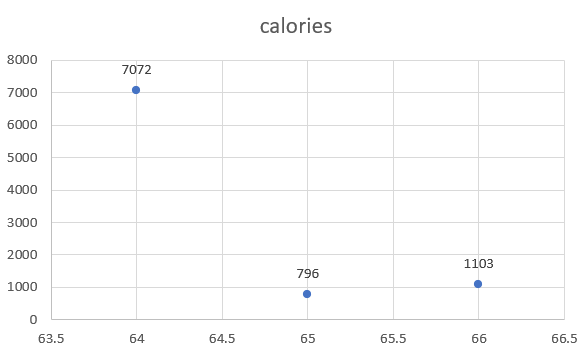
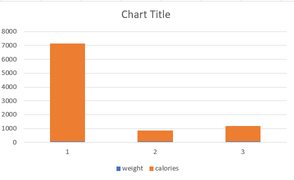

# harsha-map-reduce-fit

Daily Fitness Tracker Data

## Data

Data file was takes from kaggle.com.

It consists of data on following fields(steps, calories, hours of sleep, weight)

## Charts

- Chart displays the number of calories burnt at different weights.
- Increase in calories burnt as weight reduces.

- Highest amount of calories are burnt at weight 64.